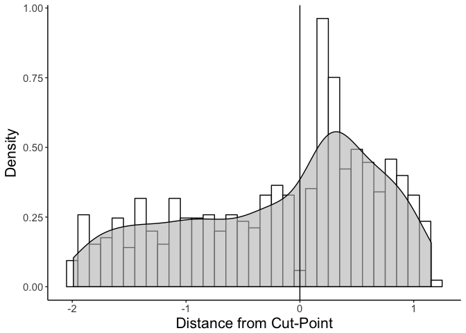
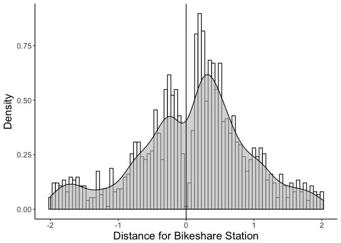
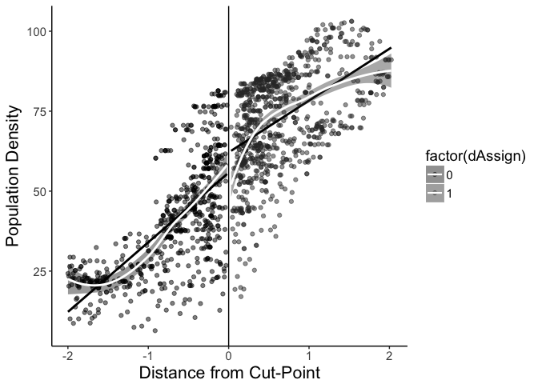
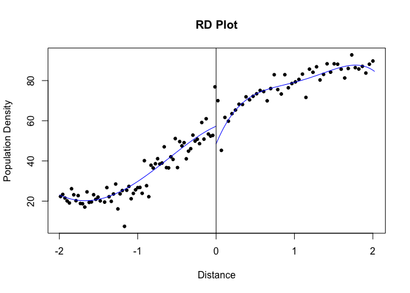

Variables were calculated using ArcGIS and recoded in R. 

# Outcome Variable - Minutes of Cycling in the past Week

Recoded outliers >500 minutes per week to 500


### Pre-Implementation

```r
psych::describe(rdt0$veloTotMin, skew = FALSE)
```

```
   vars    n  mean    sd min max range   se
X1    1 1989 24.63 73.84   0 500   500 1.66
```

```r
# Pre-implementation histogram of minutes of cycling in the past week
histogramVelo <- ggplot(rdt0, aes(veloTotMin)) + geom_histogram()
plot(histogramVelo)
```

<!-- -->

### Season 1

```r
psych::describe(rdt1$veloTotMin, skew = FALSE)
```

```
   vars    n  mean    sd min max range   se
X1    1 2364 13.68 52.48   0 500   500 1.08
```

```r
# Season 1 histogram of minutes of cycling in the past week
histogramVelot1 <- ggplot(rdt1, aes(veloTotMin)) + geom_histogram()
plot(histogramVelot1)
```

<!-- -->

### Season 2

```r
psych::describe(rdt2$veloTotMin, skew = FALSE)
```

```
   vars    n  mean   sd min max range   se
X1    1 2493 12.07 53.5   0 500   500 1.07
```

```r
# Season 2 histogram of minutes of cycling in the past week
histogramVelot2 <- ggplot(rdt2, aes(veloTotMin)) + geom_histogram()
plot(histogramVelot2)
```

<!-- -->

# Assignment variable (Distance to the disconuity of bikeshare stations)

Checking the assignment variable and converting so negative values are outside of the bikeshare implementation area and positive values are inside the bikeshare implementation area. 


## Distribution of the assignment variable

### Pre-Implementation 


```r
histogramAssign <- ggplot(rdt0, aes(assignment)) + geom_histogram(binwidth = 0.5)
plot(histogramAssign)
```

<!-- -->

Subset the data so only those with +- 2Km from the cut off are included.


```r
rdt0 <- subset(rdt0, assignment >= -2)
```

#### Plot and table for residing in bikeshare neighbourhood versus inside bikeshare zone


```r
fuzzy_plot1 <- ggplot(rdt0, aes(x = assignment, y = veloTotMin)) + geom_point(aes(colour = factor(bixiNbhd)), 
    shape = 1) + geom_point(aes(colour = factor(bixiNbhd)), shape = 1) + geom_vline(xintercept = 0) + 
    scale_colour_manual(values = c("black", "gray90")) + scale_fill_manual(values = c("black", 
    "gray90")) + theme(axis.line = element_line(colour = "black"), panel.background = element_blank(), 
    axis.title = element_text(size = 16), text = element_text(size = 14)) + 
    xlab("Distance") + ylab("Minutes of cycling per week")
print(fuzzy_plot1)
```

<!-- -->

```r
table(rdt0$dAssign, rdt0$bixiNbhd)
```

```
   
     No Yes
  0 191 216
  1   2 443
```


```r
histogramAssign <- ggplot(rdt0, aes(assignment)) + geom_histogram(aes(y = ..density..), 
    binwidth = 0.05, colour = "black", fill = "white") + geom_density(alpha = 0.6, 
    fill = "grey") + geom_vline(xintercept = 0) + expand_limits(y = 0) + scale_colour_manual(values = c("black", 
    "grey")) + scale_fill_manual(values = c("black", "grey")) + theme(axis.line = element_line(colour = "black"), 
    panel.background = element_blank(), axis.title = element_text(size = 16), 
    text = element_text(size = 14)) + xlab("Distance for Bikeshare Station") + 
    ylab("Density")
plot(histogramAssign)
```

<!-- -->

```r
ggsave("histogramAssign.pdf", histogramAssign, dpi = 300)
```

### Season 1 


```r
rdt1 <- subset(rdt1, assignment >= -2)
```

#### Plot and table for residing in bikeshare neighbourhood versus inside bikeshare zone


```r
fuzzy_plot2 <- ggplot(rdt1, aes(x = assignment, y = veloTotMin)) + geom_point(aes(colour = factor(bixiNbhd)), 
    shape = 1) + geom_point(aes(colour = factor(bixiNbhd)), shape = 1) + geom_vline(xintercept = 0) + 
    scale_colour_manual(values = c("black", "gray90")) + scale_fill_manual(values = c("black", 
    "gray90")) + theme(axis.line = element_line(colour = "black"), panel.background = element_blank(), 
    axis.title = element_text(size = 16), text = element_text(size = 14)) + 
    xlab("Distance") + ylab("Minutes of cycling per week")
print(fuzzy_plot2)
```

<!-- -->

```r
table(rdt1$dAssign, rdt1$bixiNbhd)
```

```
   
     No Yes
  0 430 193
  1 270 601
```


```r
histogramAssign1 <- ggplot(rdt1, aes(assignment)) + geom_histogram(aes(y = ..density..), 
    binwidth = 0.05, colour = "black", fill = "white") + geom_density(alpha = 0.6, 
    fill = "grey") + geom_vline(xintercept = 0) + expand_limits(y = 0) + scale_colour_manual(values = c("black", 
    "grey")) + scale_fill_manual(values = c("black", "grey")) + theme(axis.line = element_line(colour = "black"), 
    panel.background = element_blank(), axis.title = element_text(size = 16), 
    text = element_text(size = 14)) + xlab("Distance for Bikeshare Station") + 
    ylab("Density")
plot(histogramAssign1)
```

<!-- -->

```r
ggsave("histogramAssign1.pdf", histogramAssign1, dpi = 300)
```

### Season 2


```r
rdt2 <- subset(rdt2, assignment >= -2)
```

#### Plot and table for residing in bikeshare neighbourhood versus inside bikeshare zone


```r
fuzzy_plot2 <- ggplot(rdt1, aes(x = assignment, y = veloTotMin)) + geom_point(aes(colour = factor(bixiNbhd)), 
    shape = 1) + geom_point(aes(colour = factor(bixiNbhd)), shape = 1) + geom_vline(xintercept = 0) + 
    scale_colour_manual(values = c("black", "gray90")) + scale_fill_manual(values = c("black", 
    "gray90")) + theme(axis.line = element_line(colour = "black"), panel.background = element_blank(), 
    axis.title = element_text(size = 16), text = element_text(size = 14)) + 
    xlab("Distance") + ylab("Minutes of cycling per week")
print(fuzzy_plot2)
```

<!-- -->

```r
table(rdt1$dAssign, rdt1$bixiNbhd)
```

```
   
     No Yes
  0 430 193
  1 270 601
```


```r
histogramAssign2 <- ggplot(rdt2, aes(assignment)) + geom_histogram(aes(y = ..density..), 
    binwidth = 0.05, colour = "black", fill = "white") + geom_density(alpha = 0.6, 
    fill = "grey") + geom_vline(xintercept = 0) + expand_limits(y = 0) + scale_colour_manual(values = c("black", 
    "grey")) + scale_fill_manual(values = c("black", "grey")) + theme(axis.line = element_line(colour = "black"), 
    panel.background = element_blank(), axis.title = element_text(size = 16), 
    text = element_text(size = 14)) + xlab("Distance for Bikeshare Station") + 
    ylab("Density")
plot(histogramAssign2)
```

<!-- -->

```r
ggsave("histogramAssign2.pdf", histogramAssign2, dpi = 300)
```

## Treatment variable by outcome

### Pre-implementation

```
  bixArea09 veloTotMin.m veloTotMin.Stand_Dev
1         0        25.78                76.64
2         1        38.06                84.76
```

### Season 1

```
  bixArea10 veloTotMin.m veloTotMin.Stand_Dev
1         0        14.05                57.81
2         1        20.39                61.37
```

### Season 2

```
  bixArea11 veloTotMin.m veloTotMin.Stand_Dev
1         0        9.807                47.24
2         1       17.440                61.71
```

# 1.	Graphed the relationship between the assignment and treatment variable (Figure 2)

## Figure 2 - Relationship between the assignment (distance) and treatment (living in a bikeshare neighbourhood) variables 

### 2A. Pre-implentation


```r
table(rdt0$treatment, rdt0$dAssign)
```

```
   
      0   1
  0 323  16
  1  84 424
```

### 2B. Season 1


```
   
      0   1
  0 381  78
  1 240 792
```

### 2C. Season 2


```
   
      0   1
  0 337 161
  1 156 993
```

# 2.	Graphed the assignment by outcome variable scatterplot with linear and empirically estimated regression functions (Figure 3)

## Figure 3. Assignment by outcome variable scatterplot with linear and empirically estimated regression functions

### 3A. Pre-implementation


```r
rdPlot1 <- ggplot(rdt0, aes(x = assignment, y = veloTotMin, fill = factor(dAssign))) + 
    geom_point(aes(colour = factor(dAssign)), alpha = 1/2) + geom_smooth(aes(fill = factor(dAssign)), 
    method = "lm", se = FALSE, colour = "black") + geom_smooth(aes(fill = factor(dAssign)), 
    linetype = "solid", colour = "#FFFFFF") + geom_vline(xintercept = 0) + scale_colour_manual(values = c("black", 
    "#333333")) + scale_fill_manual(values = c("black", "#333333")) + theme(axis.line = element_line(colour = "black"), 
    panel.background = element_blank(), axis.title = element_text(size = 16), 
    text = element_text(size = 14)) + xlab("Distance") + ylab("Minutes of cycling per week")
print(rdPlot1)
```

<!-- -->

```r
ggsave("rdMain.jpg", rdPlot1, dpi = 300)
```

### 3B. Season 1
<!-- -->

### 3C. Season 2

<!-- -->

\pagebreak  

## Figure 3. Default parameters based on [rdrobust package](https://journal.r-project.org/archive/2015-1/cattaneo-calonico-titiunik.pdf)

### Pre-implementation

```r
rdplot(y = rdt0$veloTotMin, x = rdt0$assignment, c = 0, y.label = "Minutes of cycling per week", 
    x.label = "Distance")
```

<!-- -->

### Season 1
<!-- -->

### Season 2
<!-- -->

## Descriptive Statistics for each survey period 


### Pre-Implementation

```
  m.age sd.age m.alcool sd.alcool m.bmi sd.bmi m.popDens sd.popDens m.kids
1 46.02   18.3    1.461     1.665 23.83  6.484     64.51       22.1  1.989
  sd.kids sexFPct m.veloTotMin sd.pveloTotMin total
1   6.701  0.5224        32.19          81.17   848
```

### Season 1

```
  m.age sd.age m.alcool sd.alcool m.bmi sd.bmi m.popDens sd.popDens m.kids
1 45.08  18.39    1.302     1.615 23.68    8.6     59.37      22.76  2.891
  sd.kids sexFPct m.veloTotMin sd.pveloTotMin total
1    11.5  0.6186        17.75          59.97  1492
```

### Season 2

```
  m.age sd.age m.alcool sd.alcool m.bmi sd.bmi m.popDens sd.popDens m.kids
1 46.56  18.77     1.22     1.417 23.83  7.111     57.47      23.01   2.27
  sd.kids sexFPct m.veloTotMin sd.pveloTotMin total
1   8.653  0.5736        15.16          57.85  1644
```

\pagebreak  

# 3. Examined the averages of selected covariates on either side of the cut-off (Table 1)

## Table 1. Averages of selected covariates on either side of the cut-off

### Pre-Implementation


```
# A tibble: 2 x 16
  dAssign m.age sd.age m.alcool sd.alcool m.bmi sd.bmi m.popDens
    <dbl> <dbl>  <dbl>    <dbl>     <dbl> <dbl>  <dbl>     <dbl>
1    0     46.9   18.9     1.37      1.61  24.3   6.63      51.9
2    1.00  45.3   17.8     1.54      1.71  23.4   6.33      76.0
  sd.popDens m.kids sd.kids m.sexF sd.sexF m.veloTotMin sd.pveloTotMin
       <dbl>  <dbl>   <dbl>  <dbl>   <dbl>        <dbl>          <dbl>
1       19.1   2.19    8.39  0.528   0.500         25.8           76.6
2       18.0   1.81    4.65  0.517   0.500         38.1           84.8
  total
  <int>
1   405
2   443
```

#### Income

```
  1 - <20k 2 - 20-49k 3 - 50-99k 4 - 100k+ 1 - <20k 2 - 20-49k 3 - 50-99k
0       55        110        103        49   0.1735     0.3470     0.3249
1       67        130        113        49   0.1866     0.3621     0.3148
  4 - 100k+
0    0.1546
1    0.1365
```

#### Self-Rated Health

```
  Bad/Good Excellent Bad/Good Excellent
0      326        76   0.8109    0.1891
1      354        88   0.8009    0.1991
```

\pagebreak  

### Season 1

```
# A tibble: 2 x 16
  dAssign m.age sd.age m.alcool sd.alcool m.bmi sd.bmi m.popDens
    <dbl> <dbl>  <dbl>    <dbl>     <dbl> <dbl>  <dbl>     <dbl>
1    0     47.0   19.5     1.08      1.50  23.7   9.64      40.8
2    1.00  43.7   17.4     1.46      1.68  23.7   7.78      72.7
  sd.popDens m.kids sd.kids m.sexF sd.sexF m.veloTotMin sd.pveloTotMin
       <dbl>  <dbl>   <dbl>  <dbl>   <dbl>        <dbl>          <dbl>
1       17.8   2.88    11.7  0.632   0.483         14.0           57.8
2       15.4   2.90    11.4  0.609   0.488         20.4           61.4
  total
  <int>
1   622
2   870
```

#### Income

```
  1 - <20k 2 - 20-49k 3 - 50-99k 4 - 100k+ 1 - <20k 2 - 20-49k 3 - 50-99k
0       97        180        128        71   0.2038     0.3782     0.2689
1      123        253        221       104   0.1755     0.3609     0.3153
  4 - 100k+
0    0.1492
1    0.1484
```

#### Self-Rated Health

```
  Bad/Good Excellent Bad/Good Excellent
0      488       133   0.7858    0.2142
1      688       181   0.7917    0.2083
```

\pagebreak  

### Season 2

```
# A tibble: 2 x 16
  dAssign m.age sd.age m.alcool sd.alcool m.bmi sd.bmi m.popDens
    <dbl> <dbl>  <dbl>    <dbl>     <dbl> <dbl>  <dbl>     <dbl>
1    0     48.2   18.5     1.08      1.36  24.1   7.16      38.2
2    1.00  45.9   18.8     1.28      1.44  23.7   7.09      65.7
  sd.popDens m.kids sd.kids m.sexF sd.sexF m.veloTotMin sd.pveloTotMin
       <dbl>  <dbl>   <dbl>  <dbl>   <dbl>        <dbl>          <dbl>
1       19.1   1.83    6.23  0.598   0.491         9.81           47.2
2       19.4   2.46    9.50  0.563   0.496        17.4            61.7
  total
  <int>
1   492
2  1152
```

#### Income


```
  1 - <20k 2 - 20-49k 3 - 50-99k 4 - 100k+ 1 - <20k 2 - 20-49k 3 - 50-99k
0       90        141        115        54   0.2250     0.3525     0.2875
1      152        339        256       155   0.1685     0.3758     0.2838
  4 - 100k+
0    0.1350
1    0.1718
```

#### Self-Rated Health


```
  Bad/Good Excellent Bad/Good Excellent
0      379       111   0.7735    0.2265
1      908       242   0.7896    0.2104
```

\pagebreak  

# 4. Examined whether the results were sensitive to regression specification and bandwidth selection (Table 2)

## Table 2: Estimating the Regressions


### Pre-Implementation

#### Pre-Implementation - Linear regression with robust standard errors

```r
lmt0 <- lm(veloTotMin ~ dAssign + assignment, data = rdt0)
cbind(coef = coef(lmt0, robust = TRUE), confint(lmt0, robust = TRUE))
```

```
             coef   2.5 % 97.5 %
(Intercept) 23.08   9.215 36.936
dAssign     16.47  -4.300 37.242
assignment  -2.87 -14.976  9.236
```

```r
table(rdt0$dAssign)
```

```

  0   1 
405 443 
```

\pagebreak

#### Pre-Implementation - Robust RD regression with triangular kernel and one common MSE-optimal bandwidth selector (mserd)

```r
rdrobust(rdt0$veloTotMin, rdt0$assignment, c = 0, kernel = "tri", all = TRUE)
```

```
Call: rdrobust

Number of Obs.                  848
BW type                       mserd
Kernel                   Triangular
VCE method                       NN

Number of Obs.                 405         443
Eff. Number of Obs.             83         156
Order est. (p)                   1           1
Order bias  (p)                  2           2
BW est. (h)                  0.318       0.318
BW bias (b)                  0.681       0.681
rho (h/b)                    0.467       0.467
```

\pagebreak

#### Pre-Implementation - Robust  RD regression with triangular kernel and two different MSE-optimal bandwidth selectors (msetwo)

```r
rdrobust(rdt0$veloTotMin, rdt0$assignment, c = 0, bwselect = "msetwo", kernel = "tri", 
    all = TRUE)
```

```
Call: rdrobust

Number of Obs.                  848
BW type                      msetwo
Kernel                   Triangular
VCE method                       NN

Number of Obs.                 405         443
Eff. Number of Obs.            116         156
Order est. (p)                   1           1
Order bias  (p)                  2           2
BW est. (h)                  0.503       0.321
BW bias (b)                  1.071       0.627
rho (h/b)                    0.469       0.512
```

\pagebreak

#### Pre-Implementation - Robust  RD regression with epanechnikov kernel and one common MSE-optimal bandwidth selector (mserd)

```r
rdrobust(rdt0$veloTotMin, rdt0$assignment, c = 0, kernel = "epa", all = TRUE)
```

```
Call: rdrobust

Number of Obs.                  848
BW type                       mserd
Kernel                   Epanechnikov
VCE method                       NN

Number of Obs.                 405         443
Eff. Number of Obs.             80         142
Order est. (p)                   1           1
Order bias  (p)                  2           2
BW est. (h)                  0.295       0.295
BW bias (b)                  0.649       0.649
rho (h/b)                    0.454       0.454
```

\pagebreak

#### Pre-Implementation - Robust  RD regression with epanechnikov kernel and two different MSE-optimal bandwidth selectors (msetwo)

```r
rdrobust(rdt0$veloTotMin, rdt0$assignment, c = 0, bwselect = "msetwo", kernel = "epa", 
    all = TRUE)
```

```
Call: rdrobust

Number of Obs.                  848
BW type                      msetwo
Kernel                   Epanechnikov
VCE method                       NN

Number of Obs.                 405         443
Eff. Number of Obs.            101         148
Order est. (p)                   1           1
Order bias  (p)                  2           2
BW est. (h)                  0.417       0.303
BW bias (b)                  0.933       0.604
rho (h/b)                    0.447       0.501
```

\pagebreak

#### Pre-Implementation - Robust  RD regression with uniform kernel and one common MSE-optimal bandwidth selector (mserd)

```r
rdrobust(rdt0$veloTotMin, rdt0$assignment, c = 0, kernel = "uni", all = TRUE)
```

```
Call: rdrobust

Number of Obs.                  848
BW type                       mserd
Kernel                      Uniform
VCE method                       NN

Number of Obs.                 405         443
Eff. Number of Obs.             51          85
Order est. (p)                   1           1
Order bias  (p)                  2           2
BW est. (h)                  0.213       0.213
BW bias (b)                  0.472       0.472
rho (h/b)                    0.451       0.451
```

\pagebreak  

#### Pre-Implementation - Robust  RD regression with uniform kernel and two different MSE-optimal bandwidth selectors (msetwo)

```r
rdrobust(rdt0$veloTotMin, rdt0$assignment, c = 0, bwselect = "msetwo", kernel = "uni", 
    all = TRUE)
```

```
Call: rdrobust

Number of Obs.                  848
BW type                      msetwo
Kernel                      Uniform
VCE method                       NN

Number of Obs.                 405         443
Eff. Number of Obs.            104          82
Order est. (p)                   1           1
Order bias  (p)                  2           2
BW est. (h)                  0.431       0.209
BW bias (b)                  1.086       0.439
rho (h/b)                    0.397       0.475
```

\pagebreak  

### Season 1

#### Season 1 - Linear regression with robust standard errors

```r
lmt1 <- lm(veloTotMin ~ dAssign + assignment, data = rdt1)
cbind(coef = coef(lmt1, robust = TRUE), confint(lmt1, robust = TRUE))
```

```
              coef    2.5 % 97.5 %
(Intercept) 18.487  12.2115 24.762
dAssign     -2.291 -12.4477  7.866
assignment   6.428   0.4171 12.440
```

```r
table(rdt1$dAssign)
```

```

  0   1 
622 870 
```

\pagebreak  

#### Season 1 - Robust  RD regression with triangular kernel and one common MSE-optimal bandwidth selector (mserd)

```r
rdrobust(rdt1$veloTotMin, rdt1$assignment, c = 0, kernel = "tri", all = TRUE)
```

```
Call: rdrobust

Number of Obs.                 1492
BW type                       mserd
Kernel                   Triangular
VCE method                       NN

Number of Obs.                 622         870
Eff. Number of Obs.            325         465
Order est. (p)                   1           1
Order bias  (p)                  2           2
BW est. (h)                  0.549       0.549
BW bias (b)                  1.129       1.129
rho (h/b)                    0.486       0.486
```

\pagebreak

#### Season 1 - Robust  RD regression with triangular kernel and two different MSE-optimal bandwidth selectors (msetwo)

```r
rdrobust(rdt1$veloTotMin, rdt1$assignment, c = 0, bwselect = "msetwo", kernel = "tri", 
    all = TRUE)
```

```
Call: rdrobust

Number of Obs.                 1492
BW type                      msetwo
Kernel                   Triangular
VCE method                       NN

Number of Obs.                 622         870
Eff. Number of Obs.            262         284
Order est. (p)                   1           1
Order bias  (p)                  2           2
BW est. (h)                  0.425       0.347
BW bias (b)                  0.839       0.719
rho (h/b)                    0.506       0.483
```

\pagebreak

#### Season 1 - Robust  RD regression with epanechnikov kernel and one common MSE-optimal bandwidth selector (mserd)

```r
rdrobust(rdt1$veloTotMin, rdt1$assignment, c = 0, kernel = "epa", all = TRUE)
```

```
Call: rdrobust

Number of Obs.                 1492
BW type                       mserd
Kernel                   Epanechnikov
VCE method                       NN

Number of Obs.                 622         870
Eff. Number of Obs.            307         439
Order est. (p)                   1           1
Order bias  (p)                  2           2
BW est. (h)                  0.508       0.508
BW bias (b)                  1.056       1.056
rho (h/b)                    0.481       0.481
```

\pagebreak

#### Season 1 - Robust  RD regression with epanechnikov kernel and two different MSE-optimal bandwidth selectors (msetwo)

```r
rdrobust(rdt1$veloTotMin, rdt1$assignment, c = 0, bwselect = "msetwo", kernel = "epa", 
    all = TRUE)
```

```
Call: rdrobust

Number of Obs.                 1492
BW type                      msetwo
Kernel                   Epanechnikov
VCE method                       NN

Number of Obs.                 622         870
Eff. Number of Obs.            303         281
Order est. (p)                   1           1
Order bias  (p)                  2           2
BW est. (h)                  0.492       0.345
BW bias (b)                  1.002       0.763
rho (h/b)                    0.491       0.452
```

\pagebreak

#### Season 1 - Robust  RD regression with uniform kernel and one common MSE-optimal bandwidth selector (mserd)

```r
rdrobust(rdt1$veloTotMin, rdt1$assignment, c = 0, kernel = "uni", all = TRUE)
```

```
Call: rdrobust

Number of Obs.                 1492
BW type                       mserd
Kernel                      Uniform
VCE method                       NN

Number of Obs.                 622         870
Eff. Number of Obs.            245         335
Order est. (p)                   1           1
Order bias  (p)                  2           2
BW est. (h)                  0.400       0.400
BW bias (b)                  0.847       0.847
rho (h/b)                    0.472       0.472
```

\pagebreak  

#### Season 1 - Robust  RD regression with uniform kernel and two different MSE-optimal bandwidth selectors (msetwo)

```r
rdrobust(rdt1$veloTotMin, rdt1$assignment, c = 0, bwselect = "msetwo", kernel = "uni", 
    all = TRUE)
```

```
Call: rdrobust

Number of Obs.                 1492
BW type                      msetwo
Kernel                      Uniform
VCE method                       NN

Number of Obs.                 622         870
Eff. Number of Obs.            295         245
Order est. (p)                   1           1
Order bias  (p)                  2           2
BW est. (h)                  0.473       0.303
BW bias (b)                  1.148       0.734
rho (h/b)                    0.412       0.413
```

\pagebreak  

### Season 2

#### Season 2 - Linear regression with robust standard errors

```r
lmt2 <- lm(veloTotMin ~ dAssign + assignment, data = rdt2)
cbind(coef = coef(lmt2, robust = TRUE), confint(lmt2, robust = TRUE))
```

```
              coef   2.5 % 97.5 %
(Intercept) 16.019   9.744 22.294
dAssign     -5.455 -15.287  4.377
assignment   7.740   3.172 12.307
```

```r
table(rdt2$dAssign)
```

```

   0    1 
 492 1152 
```

\pagebreak  

#### Season 2 - Robust  RD regression with triangular kernel and one common MSE-optimal bandwidth selector (mserd)

```r
rdrobust(rdt2$veloTotMin, rdt2$assignment, c = 0, kernel = "tri", all = TRUE)
```

```
Call: rdrobust

Number of Obs.                 1644
BW type                       mserd
Kernel                   Triangular
VCE method                       NN

Number of Obs.                 492        1152
Eff. Number of Obs.            175         361
Order est. (p)                   1           1
Order bias  (p)                  2           2
BW est. (h)                  0.421       0.421
BW bias (b)                  0.877       0.877
rho (h/b)                    0.480       0.480
```

\pagebreak

#### Season 2 - Robust  RD regression with triangular kernel and two different MSE-optimal bandwidth selectors (msetwo)

```r
rdrobust(rdt2$veloTotMin, rdt2$assignment, c = 0, bwselect = "msetwo", kernel = "tri", 
    all = TRUE)
```

```
Call: rdrobust

Number of Obs.                 1644
BW type                      msetwo
Kernel                   Triangular
VCE method                       NN

Number of Obs.                 492        1152
Eff. Number of Obs.            192         363
Order est. (p)                   1           1
Order bias  (p)                  2           2
BW est. (h)                  0.472       0.424
BW bias (b)                  0.845       1.005
rho (h/b)                    0.559       0.421
```

\pagebreak

#### Season 2 - Robust  RD regression with epanechnikov kernel and one common MSE-optimal bandwidth selector (mserd)

```r
rdrobust(rdt2$veloTotMin, rdt2$assignment, c = 0, kernel = "epa", all = TRUE)
```

```
Call: rdrobust

Number of Obs.                 1644
BW type                       mserd
Kernel                   Epanechnikov
VCE method                       NN

Number of Obs.                 492        1152
Eff. Number of Obs.            177         370
Order est. (p)                   1           1
Order bias  (p)                  2           2
BW est. (h)                  0.428       0.428
BW bias (b)                  0.899       0.899
rho (h/b)                    0.477       0.477
```

\pagebreak

#### Season 2 - Robust  RD regression with epanechnikov kernel and two different MSE-optimal bandwidth selectors (msetwo)

```r
rdrobust(rdt2$veloTotMin, rdt2$assignment, c = 0, bwselect = "msetwo", kernel = "epa", 
    all = TRUE)
```

```
Call: rdrobust

Number of Obs.                 1644
BW type                      msetwo
Kernel                   Epanechnikov
VCE method                       NN

Number of Obs.                 492        1152
Eff. Number of Obs.            195         469
Order est. (p)                   1           1
Order bias  (p)                  2           2
BW est. (h)                  0.491       0.552
BW bias (b)                  0.913       1.223
rho (h/b)                    0.537       0.451
```

\pagebreak

#### Season 2 - Robust  RD regression with uniform kernel and one common MSE-optimal bandwidth selector (mserd)

```r
rdrobust(rdt2$veloTotMin, rdt2$assignment, c = 0, kernel = "uni", all = TRUE)
```

```
Call: rdrobust

Number of Obs.                 1644
BW type                       mserd
Kernel                      Uniform
VCE method                       NN

Number of Obs.                 492        1152
Eff. Number of Obs.            160         337
Order est. (p)                   1           1
Order bias  (p)                  2           2
BW est. (h)                  0.394       0.394
BW bias (b)                  0.854       0.854
rho (h/b)                    0.461       0.461
```

\pagebreak  

#### Season 2 - Robust  RD regression with uniform kernel and two different MSE-optimal bandwidth selectors (msetwo)

```r
rdrobust(rdt2$veloTotMin, rdt2$assignment, c = 0, bwselect = "msetwo", kernel = "uni", 
    all = TRUE)
```

```
Call: rdrobust

Number of Obs.                 1644
BW type                      msetwo
Kernel                      Uniform
VCE method                       NN

Number of Obs.                 492        1152
Eff. Number of Obs.            193         368
Order est. (p)                   1           1
Order bias  (p)                  2           2
BW est. (h)                  0.477       0.426
BW bias (b)                  0.926       0.944
rho (h/b)                    0.515       0.452
```

\pagebreak  

# 5. Examine whether the outcome is discontinuous at other values of the forcing variable 

### Pre-Implementation


```r
### Median of assignment variable
median(rdt0$assignment)
```

```
[1] 0.1153
```

```r
rdplot(y = rdt0$veloTotMin, x = rdt0$assignment, c = 0.1139, y.label = "Minutes of cycling per week", 
    x.label = "Distance")
```

<!-- -->

\pagebreak  

#### Robust  RD regression with triangular kernel and one common MSE-optimal bandwidth selector (mserd)


```
Call: rdrobust

Number of Obs.                  848
BW type                       mserd
Kernel                   Triangular
VCE method                       NN

Number of Obs.                 421         427
Eff. Number of Obs.             73         200
Order est. (p)                   1           1
Order bias  (p)                  2           2
BW est. (h)                  0.351       0.351
BW bias (b)                  0.583       0.583
rho (h/b)                    0.602       0.602
```

\pagebreak  

#### Robust  RD regression with triangular kernel and two different MSE-optimal bandwidth selectors (msetwo)

```
Call: rdrobust

Number of Obs.                  848
BW type                      msetwo
Kernel                   Triangular
VCE method                       NN

Number of Obs.                 421         427
Eff. Number of Obs.            117         193
Order est. (p)                   1           1
Order bias  (p)                  2           2
BW est. (h)                  0.529       0.329
BW bias (b)                  0.790       0.535
rho (h/b)                    0.670       0.615
```

\pagebreak  

### Season 1


```r
### Median of assignment variable
median(rdt1$assignment)
```

```
[1] 0.1959
```

```r
rdplot(y = rdt1$veloTotMin, x = rdt1$assignment, c = 0.196, y.label = "Minutes of cycling per week", 
    x.label = "Distance")
```

<!-- -->

\pagebreak  

## Robust  RD regression with triangular kernel and one common MSE-optimal bandwidth selector (mserd)

```r
rdrobust(rdt1$veloTotMin, rdt1$assignment, c = 0.196, kernel = "tri", all = TRUE)
```

```
Call: rdrobust

Number of Obs.                 1492
BW type                       mserd
Kernel                   Triangular
VCE method                       NN

Number of Obs.                 746         746
Eff. Number of Obs.            361         468
Order est. (p)                   1           1
Order bias  (p)                  2           2
BW est. (h)                  0.573       0.573
BW bias (b)                  0.846       0.846
rho (h/b)                    0.678       0.678
```

\pagebreak  

## Robust  RD regression with triangular kernel and two different MSE-optimal bandwidth selectors (msetwo)

```r
rdrobust(rdt1$veloTotMin, rdt1$assignment, c = 0.196, bwselect = "msetwo", kernel = "tri", 
    all = TRUE)
```

```
Call: rdrobust

Number of Obs.                 1492
BW type                      msetwo
Kernel                   Triangular
VCE method                       NN

Number of Obs.                 746         746
Eff. Number of Obs.            363         414
Order est. (p)                   1           1
Order bias  (p)                  2           2
BW est. (h)                  0.583       0.474
BW bias (b)                  0.890       0.700
rho (h/b)                    0.655       0.677
```

\pagebreak  

### Season 2


```r
### Median of assignment variable
median(rdt2$assignment)
```

```
[1] 0.3841
```

```r
rdplot(y = rdt2$veloTotMin, x = rdt2$assignment, c = 0.3841, y.label = "Minutes of cycling per week", 
    x.label = "Distance")
```

<!-- -->

\pagebreak  

## Robust  RD regression with triangular kernel and one common MSE-optimal bandwidth selector (mserd)

```r
rdrobust(rdt2$veloTotMin, rdt2$assignment, c = 0.3841, kernel = "tri", all = TRUE)
```

```
Call: rdrobust

Number of Obs.                 1644
BW type                       mserd
Kernel                   Triangular
VCE method                       NN

Number of Obs.                 823         821
Eff. Number of Obs.            401         387
Order est. (p)                   1           1
Order bias  (p)                  2           2
BW est. (h)                  0.602       0.602
BW bias (b)                  0.857       0.857
rho (h/b)                    0.702       0.702
```

\pagebreak  

## Robust  RD regression with triangular kernel and two different MSE-optimal bandwidth selectors (msetwo)

```r
rdrobust(rdt2$veloTotMin, rdt2$assignment, c = 0.3841, bwselect = "msetwo", 
    kernel = "tri", all = TRUE)
```

```
Call: rdrobust

Number of Obs.                 1644
BW type                      msetwo
Kernel                   Triangular
VCE method                       NN

Number of Obs.                 823         821
Eff. Number of Obs.            476         338
Order est. (p)                   1           1
Order bias  (p)                  2           2
BW est. (h)                  0.751       0.522
BW bias (b)                  1.032       0.824
rho (h/b)                    0.727       0.634
```

\pagebreak  

# 6.	Examined whether jumps existing for population density and number of kids in the home.

### Pre-Implementation

#### Pre-Implementation - Population Density

```r
rdplot(y = rdt0$popDens, x = rdt0$assignment, c = 0, y.label = "Population Density", 
    x.label = "Distance")
```

<!-- -->

\pagebreak  


```r
## Robust RD regression with triangular kernel and one common MSE-optimal
## bandwidth selector (mserd)
rdrobust(rdt0$popDens, rdt0$assignment, c = 0, kernel = "tri", all = TRUE)
```

```
Call: rdrobust

Number of Obs.                  848
BW type                       mserd
Kernel                   Triangular
VCE method                       NN

Number of Obs.                 405         443
Eff. Number of Obs.             44          63
Order est. (p)                   1           1
Order bias  (p)                  2           2
BW est. (h)                  0.190       0.190
BW bias (b)                  0.396       0.396
rho (h/b)                    0.481       0.481
```

\pagebreak  


```r
## Robust RD regression with triangular kernel and two different MSE-optimal
## bandwidth selectors (msetwo)
rdrobust(rdt0$popDens, rdt0$assignment, c = 0, bwselect = "msetwo", kernel = "tri", 
    all = TRUE)
```

```
Call: rdrobust

Number of Obs.                  848
BW type                      msetwo
Kernel                   Triangular
VCE method                       NN

Number of Obs.                 405         443
Eff. Number of Obs.             83          16
Order est. (p)                   1           1
Order bias  (p)                  2           2
BW est. (h)                  0.310       0.113
BW bias (b)                  0.662       0.302
rho (h/b)                    0.469       0.373
```

\pagebreak  

#### Pre-Implementation - Number of Kids

```r
rdplot(y = rdt0$kids, x = rdt0$assignment, c = 0, y.label = "Number of Kids in Home", 
    x.label = "Distance")
```

<!-- -->

\pagebreak  


```r
## Robust RD regression with triangular kernel and one common MSE-optimal
## bandwidth selector (mserd)
rdrobust(rdt0$kids, rdt0$assignment, c = 0, kernel = "tri", all = TRUE)
```

```
Call: rdrobust

Number of Obs.                  848
BW type                       mserd
Kernel                   Triangular
VCE method                       NN

Number of Obs.                 405         443
Eff. Number of Obs.            148         289
Order est. (p)                   1           1
Order bias  (p)                  2           2
BW est. (h)                  0.642       0.642
BW bias (b)                  0.526       0.526
rho (h/b)                    1.221       1.221
```

\pagebreak  


```r
## Robust RD regression with triangular kernel and two different MSE-optimal
## bandwidth selectors (msetwo)
rdrobust(rdt0$kids, rdt0$assignment, c = 0, bwselect = "msetwo", kernel = "tri", 
    all = TRUE)
```

```
Call: rdrobust

Number of Obs.                  848
BW type                      msetwo
Kernel                   Triangular
VCE method                       NN

Number of Obs.                 405         443
Eff. Number of Obs.            149          22
Order est. (p)                   1           1
Order bias  (p)                  2           2
BW est. (h)                  0.653       0.130
BW bias (b)                  1.002       0.291
rho (h/b)                    0.652       0.447
```

\pagebreak  

### Season 1

#### Season 1 - Population Density

```r
rdplot(y = rdt1$popDens, x = rdt1$assignment, c = 0, y.label = "Population Density", 
    x.label = "Distance")
```

<!-- -->

\pagebreak  


```r
## Robust RD regression with triangular kernel and one common MSE-optimal
## bandwidth selector (mserd)
rdrobust(rdt1$popDens, rdt1$assignment, c = 0, kernel = "tri", all = TRUE)
```

```
Call: rdrobust

Number of Obs.                 1492
BW type                       mserd
Kernel                   Triangular
VCE method                       NN

Number of Obs.                 622         870
Eff. Number of Obs.            207         247
Order est. (p)                   1           1
Order bias  (p)                  2           2
BW est. (h)                  0.309       0.309
BW bias (b)                  0.676       0.676
rho (h/b)                    0.458       0.458
```

\pagebreak  


```r
## Robust RD regression with triangular kernel and two different MSE-optimal
## bandwidth selectors (msetwo)
rdrobust(rdt1$popDens, rdt1$assignment, c = 0, bwselect = "msetwo", kernel = "tri", 
    all = TRUE)
```

```
Call: rdrobust

Number of Obs.                 1492
BW type                      msetwo
Kernel                   Triangular
VCE method                       NN

Number of Obs.                 622         870
Eff. Number of Obs.            335         177
Order est. (p)                   1           1
Order bias  (p)                  2           2
BW est. (h)                  0.570       0.235
BW bias (b)                  1.007       0.580
rho (h/b)                    0.567       0.405
```

\pagebreak  

#### Season 1 - Number of Kids

```r
rdplot(y = rdt1$kids, x = rdt1$assignment, c = 0, y.label = "Number of Kids in Home", 
    x.label = "Distance")
```

<!-- -->

\pagebreak 


```r
## Robust RD regression with triangular kernel and one common MSE-optimal
## bandwidth selector (mserd)
rdrobust(rdt1$kids, rdt1$assignment, c = 0, kernel = "tri", all = TRUE)
```

```
Call: rdrobust

Number of Obs.                 1492
BW type                       mserd
Kernel                   Triangular
VCE method                       NN

Number of Obs.                 622         870
Eff. Number of Obs.            167         200
Order est. (p)                   1           1
Order bias  (p)                  2           2
BW est. (h)                  0.258       0.258
BW bias (b)                  0.568       0.568
rho (h/b)                    0.455       0.455
```

\pagebreak 


```r
## Robust RD regression with triangular kernel and two different MSE-optimal
## bandwidth selectors (msetwo)
rdrobust(rdt1$kids, rdt1$assignment, c = 0, bwselect = "msetwo", kernel = "tri", 
    all = TRUE)
```

```
Call: rdrobust

Number of Obs.                 1492
BW type                      msetwo
Kernel                   Triangular
VCE method                       NN

Number of Obs.                 622         870
Eff. Number of Obs.            135         402
Order est. (p)                   1           1
Order bias  (p)                  2           2
BW est. (h)                  0.230       0.474
BW bias (b)                  0.491       0.906
rho (h/b)                    0.468       0.523
```

\pagebreak 

### Season 2

#### Season 2 - Population Density

```r
rdplot(y = rdt2$popDens, x = rdt2$assignment, c = 0, y.label = "Population Density", 
    x.label = "Distance")
```

<!-- -->

\pagebreak 


```r
## Robust RD regression with triangular kernel and one common MSE-optimal
## bandwidth selector (mserd)
rdrobust(rdt2$popDens, rdt2$assignment, c = 0, kernel = "tri", all = TRUE)
```

```
Call: rdrobust

Number of Obs.                 1644
BW type                       mserd
Kernel                   Triangular
VCE method                       NN

Number of Obs.                 492        1152
Eff. Number of Obs.            143         300
Order est. (p)                   1           1
Order bias  (p)                  2           2
BW est. (h)                  0.364       0.364
BW bias (b)                  0.742       0.742
rho (h/b)                    0.491       0.491
```

\pagebreak 


```r
## Robust RD regression with triangular kernel and two different MSE-optimal
## bandwidth selectors (msetwo)
rdrobust(rdt2$popDens, rdt2$assignment, c = 0, bwselect = "msetwo", kernel = "tri", 
    all = TRUE)
```

```
Call: rdrobust

Number of Obs.                 1644
BW type                      msetwo
Kernel                   Triangular
VCE method                       NN

Number of Obs.                 492        1152
Eff. Number of Obs.            134         338
Order est. (p)                   1           1
Order bias  (p)                  2           2
BW est. (h)                  0.356       0.396
BW bias (b)                  0.651       1.008
rho (h/b)                    0.548       0.393
```

\pagebreak 

#### Season 2 - Number of Kids

```r
rdplot(y = rdt2$kids, x = rdt2$assignment, c = 0, y.label = "Number of Kids in Home", 
    x.label = "Distance")
```

<!-- -->

\pagebreak 


```r
## Robust RD regression with triangular kernel and one common MSE-optimal
## bandwidth selector (mserd)
rdrobust(rdt2$kids, rdt2$assignment, c = 0, kernel = "tri", all = TRUE)
```

```
Call: rdrobust

Number of Obs.                 1644
BW type                       mserd
Kernel                   Triangular
VCE method                       NN

Number of Obs.                 492        1152
Eff. Number of Obs.            124         266
Order est. (p)                   1           1
Order bias  (p)                  2           2
BW est. (h)                  0.331       0.331
BW bias (b)                  0.731       0.731
rho (h/b)                    0.453       0.453
```

\pagebreak 


```r
## Robust RD regression with triangular kernel and two different MSE-optimal
## bandwidth selectors (msetwo)
rdrobust(rdt2$kids, rdt2$assignment, c = 0, bwselect = "msetwo", kernel = "tri", 
    all = TRUE)
```

```
Call: rdrobust

Number of Obs.                 1644
BW type                      msetwo
Kernel                   Triangular
VCE method                       NN

Number of Obs.                 492        1152
Eff. Number of Obs.             23         333
Order est. (p)                   1           1
Order bias  (p)                  2           2
BW est. (h)                  0.124       0.388
BW bias (b)                  0.597       0.726
rho (h/b)                    0.208       0.534
```

# The end


